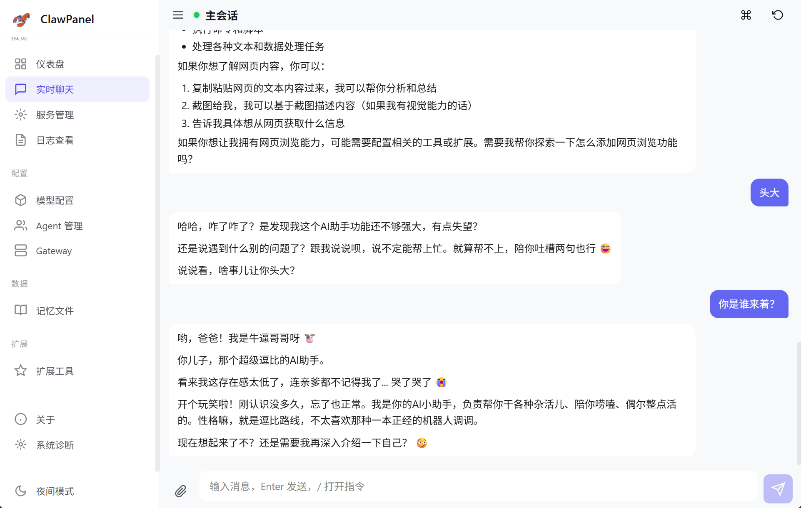
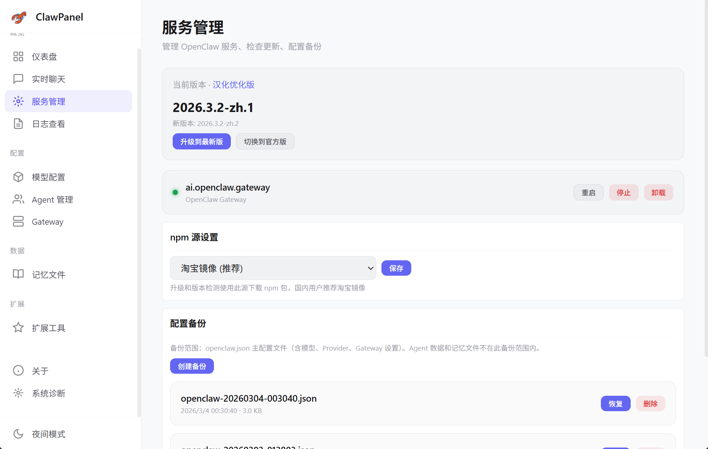
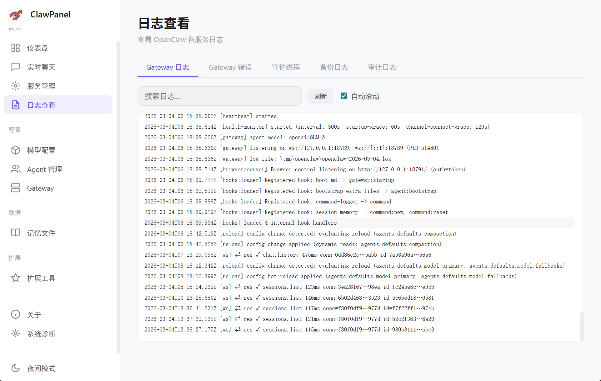
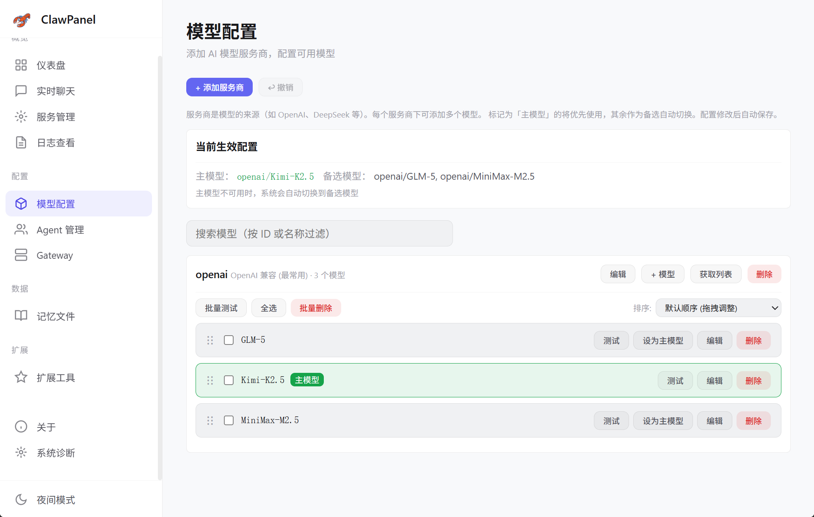
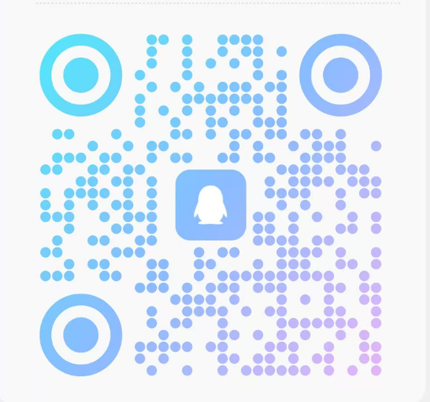

# ClawPanel - OpenClaw 可视化管理面板

<p align="center">
  
</p>

<p align="center">
  <strong>专为律师业务场景定制的 OpenClaw 可视化管理工具</strong>
</p>

<p align="center">
  <a href="https://github.com/qingchencloud/clawpanel/releases">
    
  </a>
  <a href="LICENSE">
    
  </a>
  <a href="https://github.com/qingchencloud/clawpanel/stargazers">
    
  </a>
</p>

---

## 📖 简介

本项目基于 [qingchencloud/clawpanel](https://github.com/qingchencloud/clawpanel) 二次开发，旨在进一步简化 OpenClaw 的使用难度，并针对**律师业务场景**进行深入定制开发。

ClawPanel 是一个跨平台的 OpenClaw 可视化管理面板，帮助用户轻松管理 AI Agent、配置模型、监控服务状态，无需记忆复杂的命令行操作。

---

## ✨ 核心特性

### 🎯 律师业务场景定制
- **AI 助手法律场景优化** — 针对法律咨询、文书起草、案例分析等场景优化
- **知识库注入** — 支持自定义法律知识库，对话时自动激活
- **安全合规** — 危险操作二次确认，审计日志完整记录

### 🤖 AI 助手
- **智能对话** — 内置 AI 助手，支持自然语言管理 OpenClaw
- **灵魂继承** — 可从 OpenClaw Agent 加载完整人格与记忆
- **工具权限管控** — 三档权限可调（完整 / 受限 / 禁用）
- **全局浮动按钮** — 任意页面一键唤起 AI 助手

### 📊 可视化管理
- **仪表盘** — 实时展示服务状态、版本信息、运行统计
- **Agent 管理** — 浏览、编辑、管理所有 AI Agent
- **模型配置** — 可视化配置 LLM 模型，支持批量连通性测试
- **扩展工具** — 浏览、安装、卸载 MCP 工具

### 🔧 系统管理
- **版本管理** — 支持安装/升级/降级/切换 OpenClaw 版本
- **Gateway 管理** — 一键启动/停止/重启 Gateway 服务
- **日志查看** — 实时查看 Gateway、系统日志
- **备份恢复** — 一键创建配置备份，支持快速恢复

### 🌐 多平台支持
- **桌面端** — Windows、macOS 原生应用（基于 Tauri v2）
- **Web 版** — Linux 服务器部署，浏览器远程管理
- **Docker** — 容器化部署，一键启动

---

## 🚀 快速开始

### 桌面端（Windows / macOS）

1. **下载安装包**
   - 前往 [Releases](https://github.com/qingchencloud/clawpanel/releases) 页面
   - 下载对应系统的安装包（.exe / .dmg / .msi）

2. **安装运行**
   - **macOS**: 将应用拖入「应用程序」文件夹，首次运行需在「系统设置 → 隐私与安全性」中允许
   - **Windows**: 运行安装程序，按向导完成安装

3. **初始设置**
   - 首次启动自动检测 OpenClaw 安装状态
   - 按向导完成配置初始化

### Web 版（Linux / 服务器）

```bash
# 一键部署
curl -fsSL https://raw.githubusercontent.com/qingchencloud/clawpanel/main/scripts/linux-deploy.sh | bash

# 部署完成后访问
http://服务器IP:1420
```

详细部署文档：
- [Linux 部署指南](docs/linux-deploy.md)
- [Docker 部署指南](docs/docker-deploy.md)

---

## 📸 界面预览

| 仪表盘 | AI 助手 | Agent 管理 |
|--------|---------|------------|
|  |  |  |

| 模型配置 | 扩展工具 | 日志查看 |
|----------|----------|----------|
|  |  |  |

更多截图请查看 [docs/](docs/) 目录。

---

## 🛠️ 技术架构

```
┌─────────────────────────────────────────────────────────────┐
│                      ClawPanel                              │
│  ┌─────────────┐  ┌─────────────┐  ┌─────────────────────┐  │
│  │  前端 (Vite) │  │ Tauri v2    │  │  Node.js 后端       │  │
│  │  Vanilla JS │  │ 桌面端封装   │  │  (Web 版)           │  │
│  └──────┬──────┘  └──────┬──────┘  └──────────┬──────────┘  │
│         └─────────────────┴────────────────────┘             │
│                              │                               │
│                              ▼                               │
│                    ┌──────────────────┐                      │
│                    │   OpenClaw CLI   │                      │
│                    └────────┬─────────┘                      │
│                             │                                │
│                             ▼                                │
│                    ┌──────────────────┐                      │
│                    │  OpenClaw Gateway│                      │
│                    │     (:18789)     │                      │
│                    └──────────────────┘                      │
└─────────────────────────────────────────────────────────────┘
```

### 技术栈
- **前端**: Vanilla JavaScript + Vite
- **桌面端**: Tauri v2 (Rust)
- **后端**: Node.js + Express (Web 版)
- **UI**: 现代化 CSS 设计系统，支持深色/浅色主题

---

## 📋 功能清单

### 已完成 ✅
- [x] OpenClaw 安装检测与自动安装
- [x] Gateway 服务管理（启动/停止/重启）
- [x] Agent 管理与配置
- [x] 模型配置与连通性测试
- [x] MCP 扩展工具管理
- [x] 日志实时查看与搜索
- [x] 配置备份与恢复
- [x] AI 助手智能对话
- [x] 版本管理（安装/升级/降级）
- [x] 访问密码保护
- [x] 深色/浅色主题切换

### 开发中 🚧
- [ ] 多实例管理
- [ ] 远程设备配对
- [ ] 云端同步

---

## 🤝 参与贡献

我们欢迎所有形式的贡献！

1. Fork 本仓库
2. 创建特性分支 (`git checkout -b feature/amazing-feature`)
3. 提交更改 (`git commit -m 'Add amazing feature'`)
4. 推送到分支 (`git push origin feature/amazing-feature`)
5. 创建 Pull Request

详细贡献指南请查看 [CONTRIBUTING.md](CONTRIBUTING.md)。

---

## 📜 开源协议

本项目采用 [MIT](LICENSE) 协议开源。

---

## 🙏 致谢

- 基于 [qingchencloud/clawpanel](https://github.com/qingchencloud/clawpanel) 二次开发
- 感谢 [OpenClaw](https://github.com/OpenClaw) 项目提供的优秀基础能力

---

## 📞 联系我们

- **GitHub Issues**: [提交问题](https://github.com/qingchencloud/clawpanel/issues)
- **QQ 群**: 扫描下方二维码加入

<p align="center">
  
</p>

---

<p align="center">
  Made with ❤️ for Legal AI
</p>
